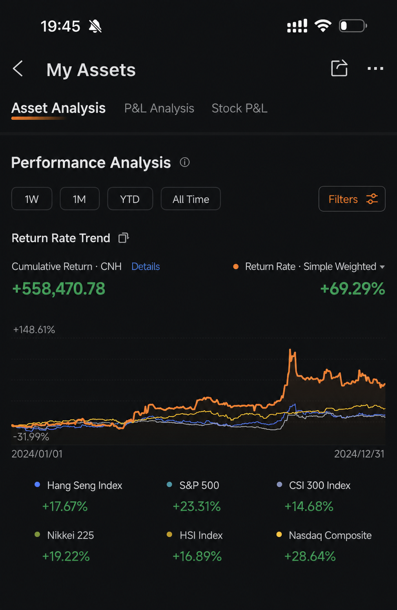
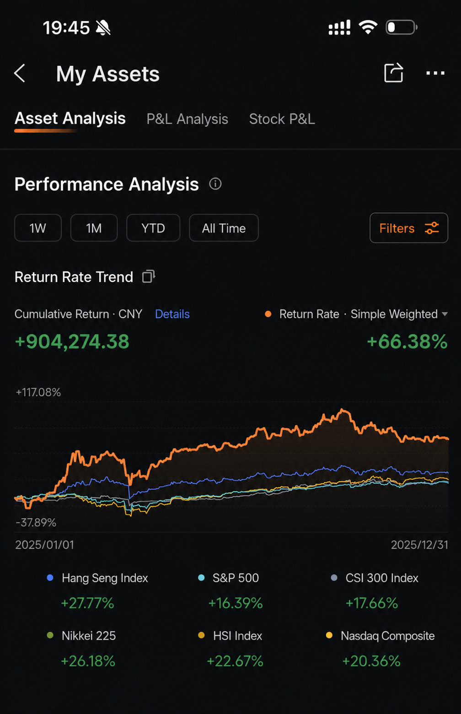
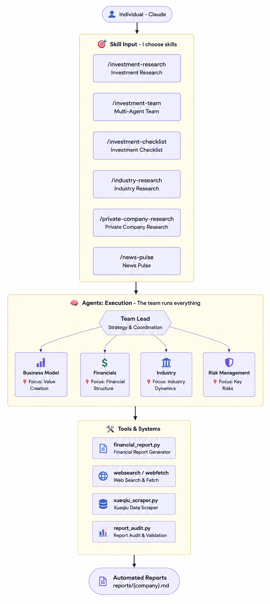

<div align="center">

# 🏛️ AI Berkshire

### Your own investment research team — in a single command

*Turn Claude into four legendary investors who research any company for you and hand you a clear, decision-ready verdict.*


> 💬 *"Price is what you pay. Value is what you get."* — Warren Buffett

</div>

---

## 🎯 What is this? (in plain English)

Imagine hiring a **team of four world-class investors** to study a stock for you — one obsesses over the business, one over the numbers, one over the competition, and one over the long-term risks. They argue, cross-check each other, and then hand you a single, honest answer: **buy it, hold it, or stay away.**

That's AI Berkshire. You type one command, and Claude becomes that team.

- 🧑‍💼 **Who it's for:** anyone who invests and wants real research, not a vague "it depends."
- ⚡ **What you do:** type a company name.
- 📄 **What you get:** a professional research report with a clear verdict, a fair-price range, and how much to buy.
- 🚫 **What it refuses to do:** sit on the fence. Every report commits to a decision.

---

## 📈 Real money, real results

> These are screenshots from a **real brokerage account** — not a simulation. *(Past performance never guarantees future results.)*

<div align="center">

&nbsp;&nbsp;

</div>

| Year | 🟢 This framework | S&P 500 | Nasdaq | Hang Seng | CSI 300 |
|:---:|:---:|:---:|:---:|:---:|:---:|
| **2024** | **🚀 +69.29%** | +23.31% | +28.64% | +17.67% | +14.68% |
| **2025** | **🚀 +66.38%** | +16.39% | +20.36% | +27.77% | +17.66% |

✨ **Two years in a row beating every major global index**, with cumulative live gains of **over ¥1.46 million**.

---

## 🪄 The magic: one command

```bash
/berkshire-skill Tencent
```

That single line runs a full **7-step investment funnel** and ends with a complete decision report:

```
1️⃣ Quality screen   →  2️⃣ Four-master research  →  3️⃣ Management check
   →  4️⃣ Earnings deep-read  →  5️⃣ Buy checklist  →  6️⃣ Thesis
      →  📄 Final Investment Decision Report
```

- 🛑 **It quits early on bad companies.** Just like a real investor, if a company fails the first quality screen, it stops — no wasting time on a lost cause.
- 🎛️ **Handy shortcuts:**
  - `quick` → a fast first look before committing to the full study
  - `force` → run everything anyway, even if it fails the screen
  - `resume` → pick up where an interrupted run left off

```bash
/berkshire-skill Apple quick     # ⚡ quick triage
/berkshire-skill Nvidia          # 🔬 the full deep dive
```

> 🧩 Want more control? Every step is **also its own command** — mix and match them (see the [full menu](#-the-full-menu-20-skills) below).

---

## 🆚 Why not just ask ChatGPT/Claude directly?

You can! But here's the difference 👇

| | 🤖 Asking AI directly | 🏛️ AI Berkshire |
|---|---|---|
| **The answer** | "On one hand… on the other hand… do your own research." | ✅ **Buy / Hold / Avoid**, with a price range |
| **Perspectives** | One voice | 🧠 Four investors who *argue* with each other |
| **The math** | Often wrong (AIs can't do mental math) | 🔢 Every number computed & double-checked |
| **Consistency** | Different every time | 🔁 Same depth and format every run |
| **Bias control** | Sounds confident, may be hollow | 🛡️ Built-in "how could this fail?" checks |

> 💡 In short: regular AI gives you *analysis that looks right*. AI Berkshire gives you *a report you can actually act on.*

---

## 🧠 Meet your four analysts

Each one looks at the company through a different lens — and they're **designed to disagree**, so blind spots get caught.

| Analyst | 🔎 Their obsession | The question they ask |
|---|---|---|
| 💰 **Warren Buffett** | The numbers & the price | *"Is it a wonderful business at a fair price?"* |
| 🧩 **Charlie Munger** | What could go wrong | *"How could this company die?"* |
| 🏭 **Duan Yongping** | The business itself | *"Is this actually a good business?"* |
| 🌱 **Li Lu** | The next 10+ years | *"Will this still matter in a decade?"* |

> 🥊 Buffett says *"it's genuinely cheap"* → Li Lu asks *"but will it exist in 10 years?"* — **that tension is exactly what protects you from a bad decision.**

---

## 📚 The full menu (20 skills)

### 🚀 The all-in-one
| Command | What it does |
|---|---|
| [`/berkshire-skill`](skills/berkshire-skill.md) | ⭐ Runs the entire funnel and delivers a final decision report |

### 🔬 Deep research
| Command | What it does |
|---|---|
| [`/investment-research`](skills/investment-research.md) | Full four-master study of a company |
| [`/investment-team`](skills/investment-team.md) | 4 AI analysts research **in parallel** — fastest & deepest |
| [`/management-deep-dive`](skills/management-deep-dive.md) | 🕵️ Investigates the people running the company |
| [`/private-company-research`](skills/private-company-research.md) | Digs into private firms (SpaceX, ByteDance…) |
| [`/deep-company-series`](skills/deep-company-series.md) | 📖 An 8-part, magazine-quality deep-dive series |

### 📊 Earnings
| Command | What it does |
|---|---|
| [`/earnings-review`](skills/earnings-review.md) | Reads the actual filings — no second-hand summaries |
| [`/earnings-team`](skills/earnings-team.md) | Four masters break down earnings → a publishable article |

### 🏭 Industries & screening
| Command | What it does |
|---|---|
| [`/industry-research`](skills/industry-research.md) | Maps every opportunity in an industry |
| [`/industry-funnel`](skills/industry-funnel.md) | Whole market → shortlist → 3 best picks |
| [`/quality-screen`](skills/quality-screen.md) | 7 quick tests to weed out weak companies |
| [`/bottleneck-hunter`](skills/bottleneck-hunter.md) | Finds the hidden choke points behind a big trend |
| [`/investment-checklist`](skills/investment-checklist.md) | ✅ Buffett's 6 gates — a 10-minute go/no-go |

### 📈 Managing your portfolio
| Command | What it does |
|---|---|
| [`/portfolio-review`](skills/portfolio-review.md) | Reviews your holdings, sizing, and balance |
| [`/thesis-tracker`](skills/thesis-tracker.md) | 🎯 Alerts you if your reason to own a stock breaks |
| [`/thesis-drift`](skills/thesis-drift.md) | Compares two research snapshots — what changed, and did your reasoning drift? |
| [`/news-pulse`](skills/news-pulse.md) | Stock jumped or crashed? Find out *why* in 10 min |

### 🧠 Thinking & writing
| Command | What it does |
|---|---|
| [`/dyp-ask`](skills/dyp-ask.md) | Think through any question, master-style |
| [`/financial-data`](skills/financial-data.md) | Pulls & cross-checks data from multiple sources |
| [`/wechat-article`](skills/wechat-article.md) | ✍️ Turns research into a polished article |

---

## ⚡ Get started in 3 steps

**1️⃣ Install Claude Code**
```bash
npm install -g @anthropic-ai/claude-code
```
*(Prefer Codex? `curl -fsSL https://chatgpt.com/codex/install.sh | sh`)*

**2️⃣ Add the skills**
```bash
git clone https://github.com/autosolutionsai-didac/ai-berkshire.git
cd ai-berkshire
./scripts/install-claude-commands.sh      # Claude Code
# ./scripts/install-codex-skills.sh       # or Codex
```

**3️⃣ Ask it anything** 🎉
```bash
/berkshire-skill Tencent          # the full study
/investment-team Meituan          # 4 analysts, in parallel
/investment-checklist Moutai, Nvidia, Apple
/news-pulse Tencent               # "why did it move?"
/dyp-ask Where is Pinduoduo's real moat?
```

---

## 🏗️ How it works

<div align="center">
  
</div>

Three simple layers:

- 🎯 **You pick a skill** — "research this company," "check these earnings," "review my portfolio."
- 🤝 **A team of AI agents runs it** — they search the web independently, challenge each other, and a lead synthesizes the answer.
- 🛠️ **Rigorous tools keep it honest** — exact math, live web search, and an auditor that **re-checks the report's numbers before it's final.**

> 🔢 **Why the math matters:** getting a P/E wrong by a decimal, or mixing up currencies, can ruin a decision. Every figure runs through exact-precision tools and is confirmed against **at least two independent sources.**

📁 Every report is saved in plain English under `reports/{Company}/` — one tidy folder per company.

---

## 🗺️ What's next

- [x] ✅ Four-master framework, parallel research team & Buffett checklist
- [x] ✅ Industry scans, private-company research, earnings deep-reads
- [x] ✅ Portfolio review, thesis tracking & exact-math tools
- [x] ✅ **One-command full pipeline (`/berkshire-skill`)**
- [ ] ⏳ Backtesting: how did past verdicts actually perform?
- [ ] ⏳ Big-picture economic cycle analysis
- [ ] ⏳ Live data feeds (Bloomberg / Yahoo Finance)

---

## ⚠️ Important

> This project is for **education and research only** and is **not investment advice**. Investing involves real risk — always do your own homework. 🙏

## 📄 License

MIT — free to use, modify, and share.

<div align="center">

---

💬 *"The best investment you can make is in yourself."* — Warren Buffett

⭐ **If this is useful to you, give it a star!** ⭐

[](https://star-history.com/#autosolutionsai-didac/ai-berkshire&Date)

</div>
